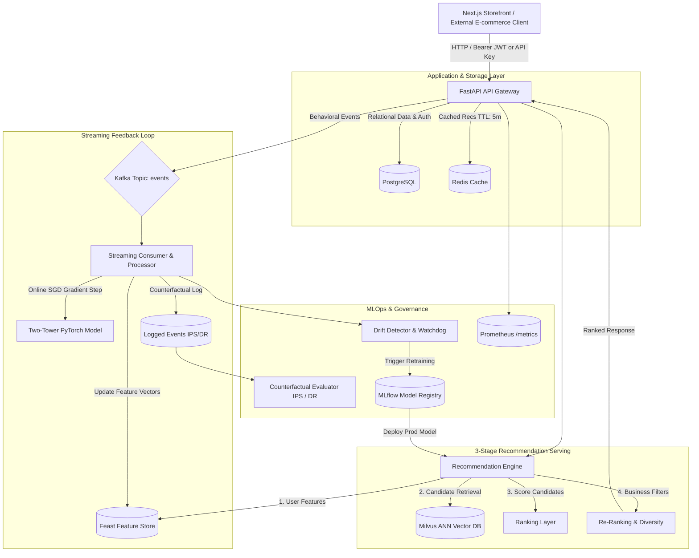
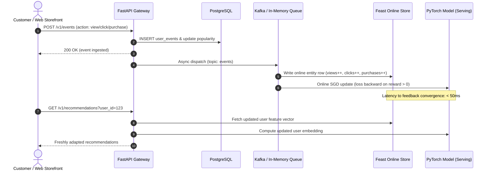

# RecommendationOS — System Architecture

RecommendationOS is an enterprise-ready, multi-tenant recommendation platform engineered for e-commerce workloads. It combines modern full-stack web capabilities (Next.js, TypeScript, PostgreSQL) with production MLOps (Two-Tower PyTorch embeddings, Milvus ANN retrieval, Feast feature store, Kafka streaming, and MLflow governance).



---

## 1. Architectural Principles (YouTube, Meta, Amazon Inspiration)

1. **Two-Stage Recommendation Pattern (YouTube)**:
   * **Stage 1 (Retrieval)**: Reduces millions of catalog items to top-50 high-probability candidates in under 5ms using 32-dimensional Two-Tower embeddings and Approximate Nearest Neighbor (ANN) search.
   * **Stage 2 (Ranking & Re-ranking)**: Applies fine-grained scoring ($0.6 \cdot \text{relevance} + 0.3 \cdot \text{popularity} + 0.1 \cdot \text{recency}$), stock availability filters, purchased item suppression, and category diversity constraints.

2. **Continuous Sourcing & Governance (Meta / Instagram)**:
   * Multi-surface candidate sourcing (Two-Tower embeddings, category candidates, popular fallbacks).
   * Governed model registry with `Staging` → `Canary` → `Production` promotions and automated rollback capabilities.

3. **Contextual E-Commerce Personalization (Amazon)**:
   * Real-time behavioral adaptation: Actions taken in the current session (views, clicks, cart adds) immediately update user features in Feast, shifting recommendations on the very next page load.
   * Item-to-item similarity recommendations for product pages ("Customers who viewed this also viewed").

---

## 2. 3-Stage Recommendation Pipeline

### Stage 1: Candidate Generation (Retrieval)
* **User Embedding**: PyTorch User Tower converts 8-dimensional user interaction vector $\mathbf{u} \in \mathbb{R}^8$ into normalized latent embedding $\mathbf{z}_u \in \mathbb{R}^{32}$.
* **Vector Search**: Milvus (or local in-memory dot-product index) queries candidate item vectors using Inner Product (IP) metric:
  $$\text{score}(u, i) = \mathbf{z}_u \cdot \mathbf{z}_i$$
* Top 50 candidates are forwarded to Stage 2.

### Stage 2: Scoring & Ranking Layer
* Candidates are scored using feature weights:
  $$\text{FinalScore} = 0.6 \cdot \text{relevance} + 0.3 \cdot \text{popularity} + 0.1 \cdot \text{recency}$$
* Cold items with low popularity receive an exploration boost ($+0.3$ recency) to avoid popularity bias.

### Stage 3: Re-Ranking & Business Constraints
* **Duplicate Suppression**: Drops redundant items.
* **Purchased Item Exclusion**: Excludes items recently bought by the user within the last 50 transactions.
* **In-Stock Filter**: Excludes out-of-stock inventory from live serving.
* **Category Diversity Constraint**: Enforces that no single category can occupy more than 40% (max 4 items) of the top 10 recommendation slots.

---

## 3. Resilience & Graceful Degradation Chain

If any ML subsystem experiences transient failures or latency spikes, the system automatically degrades through 4 fallback tiers:

```
Tier 1: Personalized Cached Recommendations (Redis, TTL 300s)
   │ (if cache miss / offline)
   ▼
Tier 2: Two-Tower Milvus ANN Retrieval (<10ms)
   │ (if vector DB timeout)
   ▼
Tier 3: Category Candidates / In-Memory Vector Fallback
   │ (if cold user / empty history)
   ▼
Tier 4: Global Popular Fallback (Top Trending Catalog Items)
```

At no point does the customer-facing storefront return a 500 error due to ML infrastructure unavailability.

---

## 4. Real-Time Streaming & Online Learning Pipeline



---

## 5. Multi-Tenancy & Security Architecture

* **Database Level**: Every application table (`products`, `categories`, `user_events`, `api_keys`, `experiments`) includes an indexed `organization_id` foreign key.
* **Application Level**: All API queries automatically scope filters by `organization_id` extracted from verified JWT tokens or authenticated `reco_live_...` API keys.
* **API Key Security**: Plaintext secret keys are only exposed once at creation. The database stores one-way SHA-256 hashes (`hashed_key`), preventing key exfiltration in database breaches.
